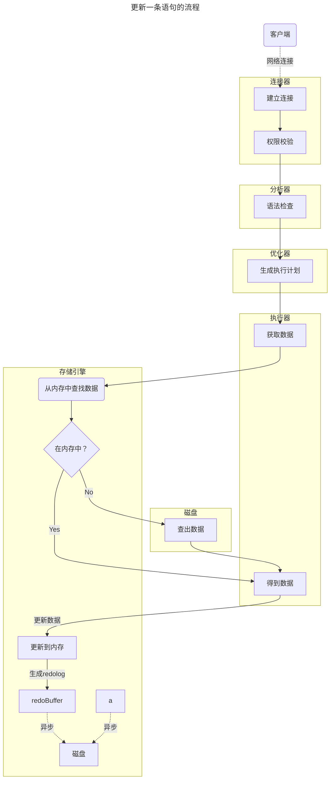

## 日志类型

|        日志类型         |                        描述                        |
| :---------------------: | :------------------------------------------------: |
|        Error Log        |               启动或者运行时错误日志               |
|    General Query Log    |               记录所有收到 SQL 语句                |
|       Binary Log        |     记录所有修改数据库内容的日志（宜用于复制）     |
|        Relay Log        | 复制过程中，从服务器用它来暂存从主服务器收到的日志 |
|     Slow Query Log      |        记录超过“long_query_time”的 SQL查询         |
| DDL Log（Matedata Log） |                 记录 DDL 相关操作                  |

默认情况下，除了Error Log，其他日志都是被关闭的。

::: warn

#todo

:::

## redo.log

### 为什么需要redo.log?

#### 没有redo时

更新或者插入执行语句的流程是：

- 在磁盘中找到对应的位置
- 插入/更新

#### 这样的缺点

找位置需要访问磁盘，操作需要考虑同步等约束，太费时间了。

#### redo解决的问题

既然找位置很浪费时间，不如先记下来，等会有时间了再写入磁盘。这个先记下来的位置就是 redo.log。

当然 redo.log也需要写入磁盘，防止崩溃丢失，但是 redo.log仅仅是追加到日志，还是比插入更新等修改数据库的逻辑要快的多。

## bin.log

## bin.log vs redo.log

|             binlog              |                          redolog                          |
| :-----------------------------: | :-------------------------------------------------------: |
| 在mysql服务器层，被存储引擎共享 |                        innodb独有                         |
|    逻辑日志，只记录原始语句     |  物理日志，记录“在 xx页的 xx偏移量的xx字节做了什么修改”   |
|         事务提交后生产          | 事务进行中，每有修改就会生 redo日志，在事务提交后写入磁盘 |
|     追加到二进制日志文件中      |                      循环写入缓冲区                       |
|     用于数据复制和数据恢复      |                   用于保证事务的持久性                    |
|            效率较低             |                          效率高                           |

# 参考文档

https://dev.mysql.com/doc/refman/8.0/en/server-logs.html
