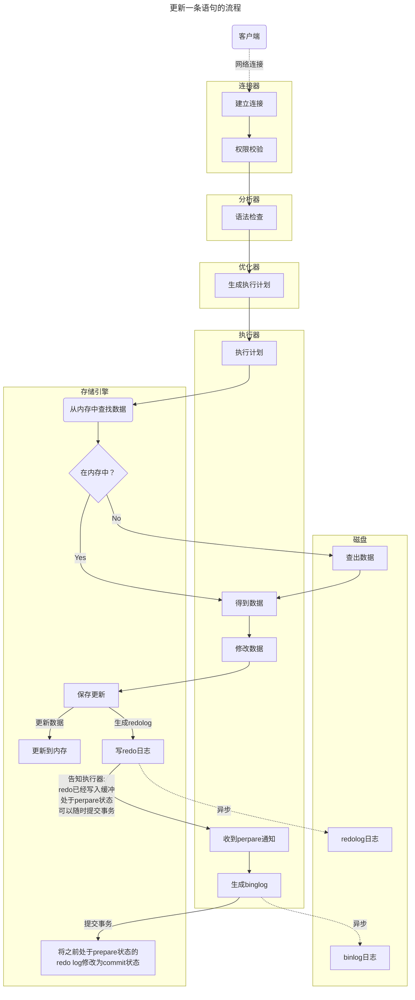

# Mysql服务器的日志类型

|        日志类型         |                        描述                        |
| :---------------------: | :------------------------------------------------: |
|        Error Log        |               启动或者运行时错误日志               |
|    General Query Log    |               记录所有收到 SQL 语句                |
|       Binary Log        |     记录所有修改数据库内容的日志（宜用于复制）     |
|        Relay Log        | 复制过程中，从服务器用它来暂存从主服务器收到的日志 |
|     Slow Query Log      |        记录超过“long_query_time”的 SQL查询         |
| DDL Log（Matedata Log） |                 记录 DDL 相关操作                  |

默认情况下，除了Error Log，其他日志都是被关闭的。

# redolog与binlog：两种保障

## 为什么需要redo.log和binlog?

1. 为了持久性：事务一旦提交，应该保障数据不会丢失。
2. 若一个更新事务以数据在索引中完毕，并持久化到磁盘中才能提交事务，那么这个事务占用的时间会很长，这大大限制了数据库的吞吐量。
3. **redolog或者 binlog 写入磁盘的速度比更新索引的速度快的多**[^1]。这意味着我们可以提前提交事务，而不用等待数据真正刷入磁盘中的索引文件。

## 为什么有两种日志？

bin.log vs redo.log

|             binlog              |                          redolog                          |
| :-----------------------------: | :-------------------------------------------------------: |
| 在mysql服务器层，被存储引擎共享 |                        innodb独有                         |
|         只记录原始语句          |       记录“在 xx页的 xx偏移量的xx字节做了什么修改”        |
|         事务提交后生产          | 事务进行中，每有修改就会生 redo日志，在事务提交后写入磁盘 |
|     追加到二进制日志文件中      |                      循环写入缓冲区                       |
|     用于数据复制和数据恢复      |                   用于保证事务的持久性                    |
|            效率较低             |                          效率高                           |

从历史角度来说：先有 binlog，主要用于数据的复制与崩溃恢复，但是 binlog 还无法保证事务的持久性，innodb 引擎自己开发了 redolog，支持了事务还提升了性能。

从mysql的层次来说：binlog 属于服务层，redolog 属于存储引擎层。

# 参考文档

https://dev.mysql.com/doc/refman/8.0/en/server-logs.html

[^1]: 这是因为日志是批量的顺序写入，但是索引的更新要涉及查找和同步操作。
