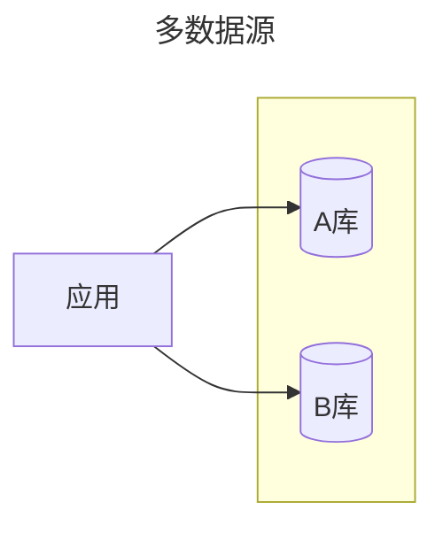
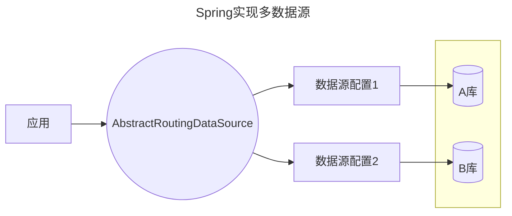

# 概述

## 什么是多数据源？

一个应用程序配置了多个数据库实例。

## 为何要多数据源？

1. 读写分离（主从架构下加快速度）
2. 数据分区（因数据量导致分区）
3. 业务隔离（因业务而导致分区）
4. 容灾备份（因安全而导致分区）
5. 异构数据库（因技术实现而导致的分区）



## 如何实现多数据源？

1. Spring方式
2. mybatis-plus方式

## 数据源与事务

1. 对于一个数据源，事务的意义往往是保证多个连接（会话）对同一个内容进行操作时的互斥状态
2. 对于多个数据源下，分布式事务的意义往往是保证他们的数据一致性

# 实现

## Spring的多数据源

### 原理



spring框架给出了一个数据源的抽象类AbstractRoutingDataSource，可以用于实现数据源的切换。

### 步骤

1. 实现AbstractRoutingDataSource 抽象类的determineCurrentLookupKey方法
2. 定义数据源Bean，然后注入RoutingDataSource
3. 查询前可手动切换数据源

### 实现抽象类

```java
public class DynamicDataSource extends AbstractRoutingDataSource {  
  
    @Override  
    protected Object determineCurrentLookupKey() {  
        // 这里返回一个决定使用哪个数据源的 key  
        // 你可以通过 ThreadLocal, Spring Security 上下文, 请求参数等方式来获取这个 key  
        return DataSourceContextHolder.getDataSourceType();  
    }  
}  
  
// 假设使用 ThreadLocal 来管理当前线程的数据源类型  
public class DataSourceContextHolder {  
    private static final ThreadLocal<String> contextHolder = new ThreadLocal<>();  
  
    public static void setDataSourceType(String dataSourceType) {  
        contextHolder.set(dataSourceType);  
    }  
  
    public static String getDataSourceType() {  
        return contextHolder.get();  
    }  
  
    public static void clearDataSourceType() {  
        contextHolder.remove();  
    }  
}
```


### 定义数据源

```java
@Bean  
public DataSource dataSource1() {  
    // 配置数据源1  
    return DataSourceBuilder.create()  
            .url("jdbc:mysql://localhost:3306/db1")  
            .username("user")  
            .password("pass")  
            .driverClassName("com.mysql.cj.jdbc.Driver")  
            .build();  
}  
  
@Bean  
public DataSource dataSource2() {  
    // 配置数据源2  
    return DataSourceBuilder.create()  
            .url("jdbc:mysql://localhost:3306/db2")  
            .username("user")  
            .password("pass")  
            .driverClassName("com.mysql.cj.jdbc.Driver")  
            .build();  
}


// 注入数据源
@Bean  
public DataSource dataSource() {  
    DynamicDataSource dataSource = new DynamicDataSource();  
    Map<Object, Object> targetDataSources = new HashMap<>();  
    targetDataSources.put("ds1", dataSource1());  
    targetDataSources.put("ds2", dataSource2());  
    dataSource.setTargetDataSources(targetDataSources);  
    dataSource.setDefaultTargetDataSource(dataSource1()); // 设置默认数据源  
    return dataSource;  
}
```

### 使用

```java
DataSourceContextHolder.setDataSourceType("ds1") DataSourceContextHolder.setDataSourceType("ds2")
```


## Mybatis plus下的多数据源

https://github.com/baomidou/dynamic-datasource

### 步骤

1. 引入依赖
2. 在application.yml中配置多个数据源地址
3. 配置mybatis-plus扫描mapper
4. 使用@DS注解来配置mapper的数据源

### 引入依赖

```xml
<!-- MyBatis-Plus 启动器 -->  
<dependency>  
    <groupId>com.baomidou</groupId>  
    <artifactId>mybatis-plus-boot-starter</artifactId>  
    <version>最新版本</version>  
</dependency>  
<!-- 多数据源管理依赖 -->  
<dependency>  
    <groupId>com.baomidou</groupId>  
    <artifactId>dynamic-datasource-spring-boot-starter</artifactId>  
    <version>最新版本</version>  
</dependency>
```

### 配置多数据源地址

```yaml
spring:  
  datasource:  
    dynamic:  
      primary: master # 设置默认的数据源或者数据源组  
      strict: false # 严格匹配数据源,默认false. true未匹配到指定数据源时抛异常,false使用默认数据源  
      datasource:  
        master:  
          url: jdbc:mysql://localhost:3306/db1?serverTimezone=UTC&useSSL=false  
          driver-class-name: com.mysql.cj.jdbc.Driver  
          username: root  
          password: 123456  
        slave_1:  
          url: jdbc:mysql://localhost:3306/db2?serverTimezone=UTC&useSSL=false  
          driver-class-name: com.mysql.cj.jdbc.Driver  
          username: root  
          password: 123456
```

### 配置mybatis plus

```java
@SpringBootApplication  
@MapperScan("com.example.mapper") // 配置mapper路径
public class Application {  
    public static void main(String[] args) {  
        SpringApplication.run(Application.class, args);  
    }  
}
```

### 使用@DS装饰mapper

```java
@DS("master") // 指定使用master数据源  
public interface UserMapper extends BaseMapper<User> {  
    // 定义CRUD操作  
}  
  
@DS("slave_1") // 指定使用slave_1数据源  
public interface ProductMapper extends BaseMapper<Product> {  
    // 定义CRUD操作  
}
```


# 应用

## 多数据源实现读写分离（mybatis plus）

1. 假如在application.yml中配置了三个数据源master、slave_1、slave_2
2. 在使用`@DS`指定数据源的时候
   1. `@DS(“master”)` : 指定了master
   2. `@DS(“slave”)` : 可指定了两个slave(以下划线前的名字自动成组，同组后可以实现负载均衡)

